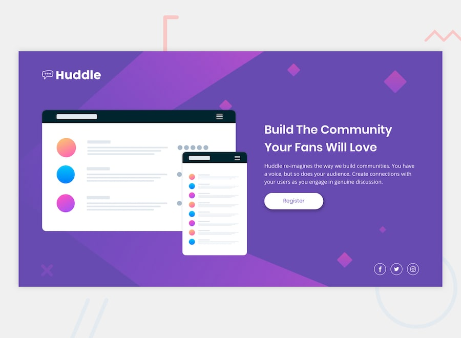

# 💻 Huddle Landing Page

This is my solution to the **Frontend Mentor - Huddle landing page with single introductory section** challenge.

## 📄 Overview

A responsive landing page built to match a static JPG design using only HTML and CSS. The page features a clean layout, hover effects, and a mobile-first approach.

## ✨ Features

- ✅ Responsive layout (mobile & desktop)
- 🎯 Hover states for all interactive elements
- 🧱 Semantic HTML5 structure
- 🎨 Custom CSS using Flexbox
- 🧼 Clean and minimal UI

## 🛠️ Built With

